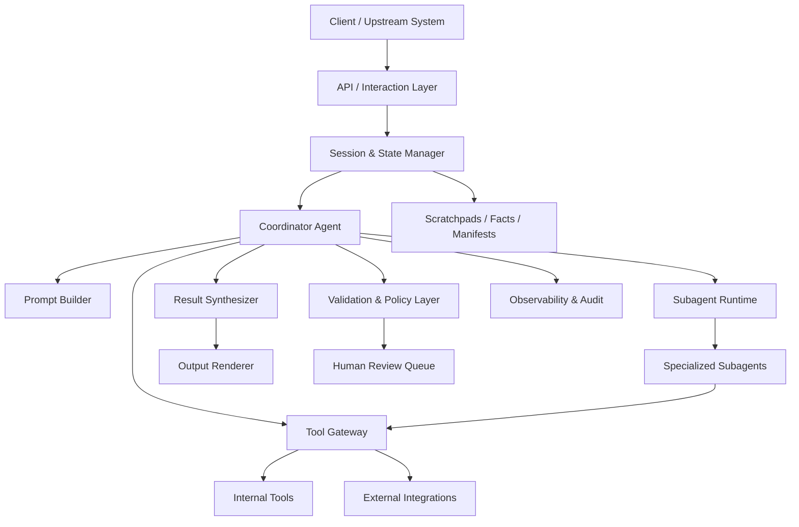

# Generic Architecture

## 1. Purpose

Этот документ описывает vendor-neutral архитектуру агентной интеллектуальной системы, собранную из четырех исходных документов:

- orchestration и multi-agent coordination
- tool layer и integration contracts
- prompt engineering и structured output
- context management, reliability и observability

Документ намеренно не привязан к конкретному языку программирования, LLM-провайдеру, облаку, мессенджеру, SDK или фреймворку. Он задает универсальную архитектурную модель, которую потом можно реализовать на любом технологическом стеке.

## 2. Architectural Goals

Система должна:

1. Решать сложные задачи через coordinator и специализированных subagents.
2. Работать через явные tool contracts, а не через неструктурированный текст.
3. Сохранять надежность при длинных сессиях, частичных ошибках и большом количестве источников.
4. Давать воспроизводимый и проверяемый результат с provenance и coverage annotations.
5. Поддерживать human-in-the-loop там, где автоматизация недостаточно надежна.
6. Оставаться переносимой между провайдерами моделей, инфраструктурой и прикладными каналами.

## 3. Core Principles

### 3.1 Vendor Neutrality

- В архитектуре нельзя зашивать конкретного LLM-провайдера, cloud vendor, transport protocol или UI-канал.
- Все внешние зависимости подключаются через адаптеры.
- Любой runtime-specific слой должен быть заменяемым без изменения бизнес-логики.

### 3.2 Coordinator-Centric Control

- Центральный coordinator управляет декомпозицией, маршрутизацией, агрегацией и финальной сборкой ответа.
- Subagents не общаются друг с другом напрямую.
- Любой обмен между subagents идет только через coordinator.

### 3.3 Explicit Contracts Over Implicit Behavior

- Каждый tool, subagent и pipeline stage должен иметь явный контракт входа и выхода.
- Structured output предпочтительнее свободного текста.
- Политики, которые должны соблюдаться всегда, реализуются hooks/interceptors, а не только prompt-инструкциями.

### 3.4 Reliability by Design

- Частичные ошибки не должны рушить весь pipeline без необходимости.
- Пустой результат и сбой выполнения считаются разными состояниями.
- Критические факты, provenance и state должны храниться отдельно от обычной диалоговой истории.

### 3.5 Progressive Trust

- Автоматизация допускается только после сегментированной валидации и калибровки confidence.
- Сомнительные и конфликтные кейсы маршрутизируются на дополнительную проверку.
- Система обязана уметь явно говорить о пробелах покрытия, а не создавать ложную определенность.

## 4. High-Level Architecture

## 5. Logical Layers

## 5.1 Interaction Layer

Отвечает за прием запроса из любого канала и преобразование его в унифицированный internal request.

Responsibilities:

- нормализация входного запроса
- присвоение `request_id`, `session_id`, `trace_id`
- первичная валидация и rate/control gating
- передача запроса в coordinator runtime

На этом слое не должно быть бизнес-логики агентной системы.

## 5.2 Session and State Layer

Отвечает за жизненный цикл сессии и внешнее хранение состояния.

Stores:

- session metadata
- persistent facts blocks
- scratchpads
- phase summaries
- state manifests
- final artifacts

Состояние хранится вне conversational history, потому что история может быть сокращена, пересобрана или переинициализирована.

## 5.3 Coordinator Layer

Coordinator является главным управляющим контуром системы.

Responsibilities:

- классификация типа задачи
- выбор fixed pipeline или adaptive decomposition
- выбор subagents
- выбор tools
- контроль `continue/stop`
- сбор partial results
- проверка coverage gaps
- финальная синтезация результата

Coordinator не должен заниматься глубоким выполнением каждой подзадачи сам, если ее можно безопасно делегировать.

## 5.4 Subagent Layer

Subagents являются изолированными исполнителями с узкой специализацией.

Examples of roles:

- retrieval agent
- analysis agent
- verification agent
- extraction agent
- synthesis support agent
- compliance/policy agent

Rules:

- каждый subagent получает только явно переданный контекст
- общей памяти между subagents нет
- прямого peer-to-peer общения нет
- независимые subagents запускаются параллельно

## 5.5 Tool Gateway Layer

Это единый слой вызова инструментов и внешних интеграций.

Responsibilities:

- регистрация tool schemas
- execution routing
- pre-execution policy hooks
- post-execution normalization hooks
- unified error mapping
- timeout/retry orchestration
- least-privilege enforcement

Tool gateway отделяет агентную логику от конкретного транспорта и реализации инструмента.

## 5.6 Validation and Policy Layer

Этот слой отвечает за deterministic enforcement.

Includes:

- input validation
- schema validation
- semantic validation
- policy checks
- guardrails
- escalation rules
- confidence routing rules

Если правило нельзя нарушать ни при каких обстоятельствах, оно должно жить здесь, а не только в system prompt.

## 5.7 Synthesis and Rendering Layer

Отвечает за:

- сбор структурированных findings
- сохранение claim-source mappings
- обработку конфликтов
- подготовку результата под нужный формат представления

Rendering должен зависеть от типа результата:

- числовые данные в таблицах
- narrative findings в связном тексте
- технические findings в структурированных списках

## 5.8 Observability and Audit Layer

Отвечает за трассировку и контроль качества.

Captures:

- agent decisions
- tool calls
- retries
- failures
- latency
- token/compute usage
- coverage gaps
- confidence values
- human review outcomes

## 6. Canonical Processing Flow

## 6.1 Request Lifecycle

1. Interaction layer принимает запрос.
2. Session layer загружает relevant state.
3. Coordinator определяет тип workflow.
4. Prompt builder собирает актуальный контекст.
5. Coordinator либо отвечает сам, либо вызывает tools/subagents.
6. Tool/subagent results нормализуются и валидируются.
7. Coordinator проверяет полноту и качество покрытия.
8. При необходимости запускаются retry, fallback или escalation.
9. Synthesizer формирует итоговый ответ с provenance.
10. Renderer отдает результат вызывающей стороне.
11. Observability layer пишет следы выполнения.

## 6.2 Agentic Loop Contract

Базовый цикл должен быть управляемым не эвристикой по тексту ответа, а явным signal-based control flow.

Canonical loop:

1. модель получает контекст
2. модель выбирает один из вариантов:
   - завершить работу
   - вызвать tool
   - делегировать задачу subagent
3. runtime исполняет выбранное действие
4. результат действия возвращается в history/state
5. цикл повторяется до явного завершения

Технический runtime может использовать разные сигналы остановки, но архитектурно цикл должен опираться на явный machine-readable stop state.

## 6.3 Fixed vs Adaptive Pipelines

Использование pipeline зависит от природы задачи.

Fixed pipeline:

- подходит для предсказуемых процессов
- порядок шагов известен заранее
- проще валидировать и мониторить

Adaptive decomposition:

- подходит для исследовательских задач
- coordinator меняет план по ходу выполнения
- требует сильнее выраженных state, tracing и coverage controls

## 7. Component Contracts

## 7.1 Request Contract

Минимальный внутренний request должен содержать:

- `request_id`
- `session_id`
- `trace_id`
- `task_type`
- `input_payload`
- `user_constraints`
- `priority`
- `deadline` if applicable
- `attachments` or references

## 7.2 Finding Contract

Каждый finding должен быть структурирован.

Recommended fields:

- `finding_id`
- `category`
- `claim`
- `supporting_evidence`
- `confidence`
- `status`
- `coverage_scope`
- `metadata`

## 7.3 Provenance Contract

Для проверяемых выводов нужен явный mapping к источнику.

Recommended fields:

- `claim`
- `source_id`
- `source_name`
- `source_locator`
- `relevant_excerpt`
- `publication_or_effective_date`
- `retrieval_timestamp`

## 7.4 Tool Result Contract

Любой tool должен возвращать не просто текст, а структурированный результат.

Recommended fields:

- `success`
- `is_error`
- `error_category`
- `is_retryable`
- `result_type`
- `payload`
- `metadata`
- `partial_results`
- `attempted_action`
- `suggested_next_steps`

## 7.5 Subagent Result Contract

Subagent должен возвращать:

- `task_summary`
- `status`
- `findings`
- `open_questions`
- `coverage_gaps`
- `errors`
- `partial_results`
- `used_sources`
- `recommended_next_actions`

## 8. Orchestration Model

## 8.1 Coordinator Responsibilities

Coordinator обязан:

- декомпозировать задачу на разумные подзадачи
- не дробить задачу слишком узко
- явно передавать subagents весь необходимый контекст
- запускать независимые задачи параллельно
- пересобирать результат и проверять пропуски
- переотправлять только непокрытые части работы

## 8.2 Subagent Isolation

Изоляция нужна для:

- уменьшения шумового контекста
- ограничения scope
- повышения predictability
- улучшения observability

Subagent не должен автоматически наследовать:

- всю историю coordinator
- результаты других subagents
- не относящиеся к задаче tools

## 8.3 Parallelism Rules

Параллелить стоит только независимые подзадачи.

Good candidates:

- анализ независимых документов
- поиск по независимым источникам
- проверка нескольких гипотез
- per-file passes

Не стоит параллелить шаги, где следующая задача зависит от результата предыдущей.

## 9. Tooling Architecture

## 9.1 Tool Design Principles

Каждый tool должен иметь:

- четкое назначение
- понятные границы применения
- примеры входов
- описание ограничений
- явное различие с похожими tools

Если инструменты часто путаются, первый фикс это не classifier, а улучшение descriptions и boundaries.

## 9.2 Tool Scoping

Набор tools на агента должен быть минимальным и ролевым.

Rules:

- не выдавать всем агентам общий гигантский toolset
- держать scope узким
- избегать избыточных cross-role capabilities
- использовать least-privilege доступ

## 9.3 Tool Choice Modes

Архитектура должна поддерживать три режима вызова:

- optional tool use
- mandatory tool use
- forced specific tool use

Это нужно для разных сценариев:

- свободная reasoning-задача
- гарантированный structured output
- обязательный конкретный этап pipeline

## 9.4 Hook Points

Нужны как минимум два типа hooks:

- pre-execution hook
- post-execution hook

Pre-execution hook uses:

- policy enforcement
- permission checks
- routing overrides
- dangerous action blocking

Post-execution hook uses:

- normalization
- trimming
- schema repair
- metadata enrichment

## 9.5 Integration Adapters

Внешние системы должны подключаться через адаптеры.

Adapter responsibilities:

- transport translation
- auth injection
- response normalization
- error classification
- timeout policy

Архитектура должна поддерживать как готовые интеграции, так и кастомные адаптеры без изменения coordinator logic.

## 10. Prompt and Output Architecture

## 10.1 Prompt Stack

Prompt stack должен быть многослойным:

1. global system policy
2. role-specific instructions
3. task-specific objective
4. current state and constraints
5. structured facts
6. recent relevant tool/subagent outputs
7. output contract

## 10.2 Prompt Rules

Prompting должен использовать:

- явные критерии вместо расплывчатых пожеланий
- примеры severity и category boundaries
- few-shot examples только там, где они реально стабилизируют output
- explicit exclusion criteria

## 10.3 Structured Output

Если downstream ожидает машинно-читаемый результат, output должен быть schema-driven.

Rules:

- optional/nullable поля обязательны там, где данные могут отсутствовать
- `other` и `unclear` допустимы для неоднозначных кейсов
- schema валидирует форму, но не гарантирует смысловую корректность

## 10.4 Validation-Retry Loop

После structured extraction должен существовать semantic validation layer.

Retry применим только к исправимым ошибкам:

- format mismatch
- structural mismatch
- misplaced values
- logical inconsistency

Retry бесполезен, если нужной информации нет в исходном материале.

## 11. Context Management Architecture

## 11.1 Persistent Facts Block

Все критические факты должны жить в отдельном structured block, а не только в summarized history.

Examples:

- identifiers
- dates
- statuses
- numeric values
- policy states
- user constraints

## 11.2 Summarized History

Обычную диалоговую историю можно сжимать, но:

- нельзя терять transactional facts
- нельзя терять active decisions
- нельзя терять unresolved risks

## 11.3 Scratchpads

Для длинных исследований нужны внешние scratchpad artifacts.

They store:

- key findings
- explored areas
- unresolved questions
- hypotheses
- evidence map

## 11.4 Phase Summaries

Между стадиями длинного workflow нужно передавать summary injection:

- что уже проверено
- что найдено
- где пробелы
- что делать дальше

## 11.5 State Manifest

Для возобновления долгих процессов нужен manifest.

Recommended contents:

- current phase
- completed steps
- pending steps
- artifacts produced
- known blockers
- next recommended action

## 12. Reliability and Error Handling

## 12.1 Error Taxonomy

Все ошибки должны классифицироваться как минимум на:

- `transient`
- `validation`
- `business`
- `permission`
- `unknown`

## 12.2 Error Semantics

Нужно четко различать:

- successful empty result
- execution failure
- partial success
- policy-blocked action

Путать эти случаи нельзя, иначе coordinator принимает неправильные recovery decisions.

## 12.3 Partial Failure Handling

Один провалившийся subagent или tool не должен автоматически ронять весь pipeline.

Instead:

- сохранить partial results
- отметить coverage gap
- запустить targeted retry or fallback
- эскалировать только непокрытую часть

## 12.4 Retry Policy

Retry должен быть:

- ограниченным
- типизированным по error class
- идемпотентным там, где это нужно
- наблюдаемым через логи и метрики

## 12.5 Fresh Start vs Resume

Архитектура должна поддерживать три режима продолжения работы:

- resume existing session
- fork from prior state
- fresh start with summary injection

Use cases:

- `resume` when state still valid
- `fork` when comparing alternatives
- `fresh start` when prior context/tool outputs stale

## 13. Human-in-the-Loop

Human review нужен не как декоративный этап, а как управляемый механизм снижения риска.

Trigger classes:

- explicit human escalation request
- policy gap or exception
- unresolved ambiguity
- low-confidence after calibration
- conflicting evidence
- material business impact

Human review queue должна получать:

- compact case summary
- structured findings
- provenance
- explanation of uncertainty
- attempted actions

## 14. Monitoring and Quality Control

## 14.1 Operational Telemetry

Must capture:

- request counts
- latency by stage
- tool failure rates
- retry rates
- escalation rates
- queue sizes
- completion rates

## 14.2 Quality Telemetry

Must capture:

- accuracy by segment
- false positive rate by category
- false negative rate where measurable
- confidence calibration quality
- human override rate
- conflict frequency
- coverage gap frequency

## 14.3 Review Strategy

Нельзя опираться только на aggregate metrics.

Нужны:

- segmentation by task/document/problem type
- segmentation by field/category
- calibrated thresholds
- stratified sampling of high-confidence cases

## 15. Security and Configuration Principles

## 15.1 Secret Handling

- Секреты не хранятся в архитектурных документах, prompts, shared configs или version-controlled examples.
- Credentials передаются через runtime secret management.
- Tool adapters получают доступ к секретам только по принципу least privilege.

## 15.2 Configuration Boundaries

Нужно разделять:

- shared team configuration
- local developer configuration
- runtime environment configuration

Архитектурные контракты должны быть общими, а credentials и environment-specific values изолированными.

## 16. Deployment-Neutral Runtime View

Архитектура должна поддерживать несколько вариантов развертывания без изменения core design:

- monolith runtime
- service-oriented deployment
- queue-based asynchronous processing
- hybrid sync/async model

Выбор deployment-модели не должен менять:

- оркестрационный контракт
- tool contracts
- state model
- validation model
- provenance requirements

## 17. Recommended Internal Modules

Vendor-neutral разбиение может выглядеть так:

- `interaction`
- `coordinator`
- `subagents`
- `prompting`
- `tools`
- `adapters`
- `validation`
- `state`
- `storage`
- `observability`
- `review`
- `rendering`
- `policies`

## 18. Non-Functional Requirements

Система должна обеспечивать:

- reproducibility of decisions
- auditability of outputs
- bounded failure behavior
- replaceable integrations
- scalable orchestration
- maintainable prompt contracts
- explicit uncertainty handling

## 19. Anti-Patterns to Avoid

- vendor-specific logic in core architecture
- giant unscoped toolsets
- silent suppression of tool failures
- mixing empty results with failed execution
- storing critical facts only in chat history
- relying on vague prompts for hard policy enforcement
- collapsing all quality into one aggregate metric
- losing provenance during synthesis
- forcing every workflow through the same rigid pipeline
- reading or processing everything in one pass when multi-pass architecture is needed

## 20. Target End State

Итоговая система должна представлять собой универсальную agentic platform с такими свойствами:

- coordinator управляет процессом и качеством результата
- subagents изолированно решают узкие подзадачи
- tools подключаются через нормализованный gateway
- prompts и outputs управляются контрактами, а не надеждой
- context хранится в structured state, а не только в переписке
- reliability обеспечивается через taxonomy, retries, partial continuation и escalation
- observability позволяет понять не только что система сделала, но и почему
- core architecture переносима на любой конкретный стек реализации

## 21. Next Step

Этот документ является generic baseline. Следующий слой проектирования должен быть отдельным документом implementation architecture, где generic-модель будет привязана к конкретному стеку, runtime, API-провайдеру, каналам доставки, инфраструктуре и deployment strategy.
