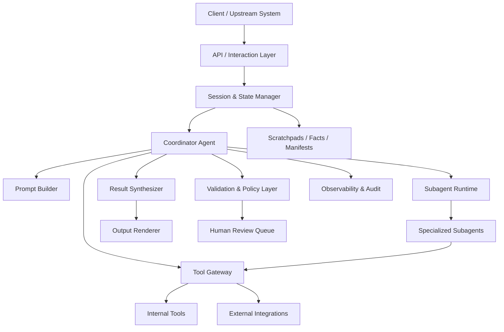

# Generic Architecture

## 1. Purpose

Этот документ описывает vendor-neutral архитектуру агентной интеллектуальной системы, собранную из четырех исходных документов:

- orchestration и multi-agent coordination
- tool layer и integration contracts
- prompt engineering и structured output
- context management, reliability и observability

Документ намеренно не привязан к конкретному языку программирования, LLM-провайдеру, облаку, мессенджеру, SDK или фреймворку. Он задает универсальную архитектурную модель, которую потом можно реализовать на любом технологическом стеке.

## 2. Architectural Goals

Система должна:

1. Решать сложные задачи через coordinator и специализированных subagents.
2. Работать через явные tool contracts, а не через неструктурированный текст.
3. Сохранять надежность при длинных сессиях, частичных ошибках и большом количестве источников.
4. Давать воспроизводимый и проверяемый результат с provenance и coverage annotations.
5. Поддерживать human-in-the-loop там, где автоматизация недостаточно надежна.
6. Оставаться переносимой между провайдерами моделей, инфраструктурой и прикладными каналами.

## 2.1 Glossary

- coordinator
  Центральный управляющий контур, который принимает orchestration decisions, делегирует работу и собирает итоговый результат.
- subagent
  Изолированный исполнитель с ограниченным scope, которому coordinator передает конкретную подзадачу.
- tool
  Формализованный capability endpoint с явным входным и выходным контрактом.
- tool gateway
  Единый слой, через который проходят tool registration, routing, validation, policy checks и normalization.
- contract
  Явное описание ожидаемых входов, выходов, допустимых состояний и ошибок.
- artifact
  Любой typed output, produced outside plain narrative text: finding, attachment, manifest, trace, stored result и similar objects.
- finding
  Структурированное утверждение или вывод, который система считает значимым результатом анализа.
- provenance
  Связь между утверждением и источником, объясняющая, откуда взят факт и на чем он основан.
- coverage gap
  Явно зафиксированная область, где система не получила достаточного покрытия, уверенности или верификации. В тексте ниже также может называться `пробел покрытия`.
- manifest / state manifest
  Структурированное описание текущего состояния процесса, его фазы, артефактов и следующих шагов. Если не сказано иное, далее manifest подразумевает state manifest.
- scratchpad
  Внешний рабочий артефакт для промежуточных заметок, гипотез, evidence map и phase-level thinking.
- transcript
  Последовательность conversational events, которая сохраняет lineage взаимодействия между сторонами и системой.
- history
  В этом документе history используется только для локального рабочего контекста; persistent lineage далее называется transcript.
- derived context
  Контекст, который пересобирается для конкретного turn и не обязан быть частью persistent transcript.
- policy
  Набор обязательных ограничений и правил, которые runtime должен enforce независимо от prompt wording.
- validation
  Проверка формы, допустимости или смысла данных до, во время или после выполнения.
- observability
  Совокупность traces, metrics, logs и audit artifacts, позволяющих понять, что система сделала и почему.
- telemetry
  Подмножество observability signals, используемое для measurement, quality tracking и operational analytics.
- audit
  Traceability perspective на observability, ориентированная на reconstructability, provenance и объяснимость решений.
- human-in-the-loop
  Режим, в котором система передает часть решения, подтверждения или разбора человеку при недостаточной надежности автоматизации.

## 2.2 Non-Goals

Этот документ не пытается:

- зафиксировать конкретный технологический стек
- описать UI/UX конкретного продукта
- выбрать конкретные модели, базы данных или transport protocols
- заменить implementation architecture, runbook или API specification
- доказать, что одна deployment model универсально лучше другой

Его задача — задать устойчивые архитектурные границы и контракты, которые остаются полезными при смене реализации.

## 3. Core Principles

### 3.1 Vendor Neutrality

- В архитектуре нельзя зашивать конкретного LLM-провайдера, cloud vendor, transport protocol или UI-канал.
- Все внешние зависимости подключаются через адаптеры.
- Любой runtime-specific слой должен быть заменяемым без изменения бизнес-логики.

### 3.2 Coordinator-Centric Control

- Центральный coordinator управляет декомпозицией, маршрутизацией, агрегацией и финальной сборкой ответа.
- Subagents не общаются друг с другом напрямую.
- Любой обмен между subagents идет только через coordinator.

### 3.3 Explicit Contracts Over Implicit Behavior

- Каждый tool, subagent и pipeline stage должен иметь явный контракт входа и выхода.
- Structured output предпочтительнее свободного текста.
- Политики, которые должны соблюдаться всегда, реализуются hooks/interceptors, а не только prompt-инструкциями.

### 3.4 Reliability by Design

- Частичные ошибки не должны рушить весь pipeline без необходимости.
- Пустой результат и сбой выполнения считаются разными состояниями.
- Критические факты, provenance и state должны храниться отдельно от обычной диалоговой истории.

### 3.5 Progressive Trust

- Автоматизация допускается только после сегментированной валидации и калибровки confidence.
- Сомнительные и конфликтные кейсы маршрутизируются на дополнительную проверку.
- Система обязана уметь явно говорить о пробелах покрытия, а не создавать ложную определенность.

## 3.6 Cross-Layer Mapping

Для любого технического аспекта в этом документе рекомендуется использовать одну и ту же объяснительную рамку.

Use this explanation format for every technical topic:

1. Idea level
   Какую проблему решает данный механизм и зачем он вообще существует.
2. Language/API level
   Что именно проектировщик или инженер объявляет, вызывает или конфигурирует.
3. Planner/runtime level
   Как orchestration layer принимает решение и как выполнение реально запускается.
4. Storage/data-structure level
   В каком виде представлены state, contracts, artifacts и execution metadata.
5. OS/hardware level
   Что происходит на уровне CPU, memory, network, disk, processes, queues или timers.
6. Complexity/perf level
   Какова asymptotic complexity, где реальные bottlenecks и что ограничивает масштабирование.
7. One-liner
   Одно предложение, которое фиксирует суть механизма без деталей.

Этот формат нужен, чтобы:

- не смешивать intent, API, runtime и storage в одно описание
- легче сравнивать разные архитектурные решения между собой
- быстрее находить слой, на котором именно возникает проблема
- удерживать документ одновременно полезным для design, implementation и review

Последующие секции не обязаны явно расписывать все семь уровней каждый раз, но должны оставаться совместимыми с этой линзой.

## 4. High-Level Architecture

## 5. Logical Layers

## 5.1 Interaction Layer

Отвечает за прием запроса из любого канала и преобразование его в унифицированный internal request.

Responsibilities:

- нормализация входного запроса
- присвоение `request_id`, `session_id`, `trace_id`
- первичная валидация и rate/control gating
- передача запроса в coordinator runtime

На этом слое не должно быть бизнес-логики агентной системы.

## 5.2 Session and State Layer

Отвечает за жизненный цикл сессии и внешнее хранение состояния.

Stores:

- session metadata
- persistent facts blocks
- scratchpads
- phase summaries
- state manifests
- final artifacts

Состояние хранится вне transcript, потому что transcript может быть сокращен, пересобран или переинициализирован.

## 5.3 Coordinator Layer

Coordinator является главным управляющим контуром системы.

Responsibilities:

- классификация типа задачи
- выбор fixed pipeline или adaptive decomposition
- выбор subagents
- выбор tools
- контроль `continue/stop`
- сбор partial results
- проверка coverage gaps
- финальная синтезация результата

Coordinator не должен заниматься глубоким выполнением каждой подзадачи сам, если ее можно безопасно делегировать.

## 5.4 Subagent Layer

Subagents являются изолированными исполнителями с узкой специализацией.

Examples of roles:

- retrieval agent
- analysis agent
- verification agent
- extraction agent
- synthesis support agent
- compliance/policy agent

Rules:

- каждый subagent получает только явно переданный контекст
- общей памяти между subagents нет
- прямого peer-to-peer общения нет
- независимые subagents запускаются параллельно

## 5.5 Tool Gateway Layer

Это единый слой вызова инструментов и внешних интеграций.

Responsibilities:

- регистрация tool schemas
- execution routing
- pre-execution policy hooks
- post-execution normalization hooks
- unified error mapping
- timeout/retry orchestration
- least-privilege enforcement

Tool gateway отделяет агентную логику от конкретного транспорта и реализации инструмента.

В этом документе исходный tool layer operationally выражается через tool gateway.

## 5.6 Validation and Policy Layer

Этот слой отвечает за deterministic enforcement.

Includes:

- input validation
- schema validation
- semantic validation
- policy checks
- policy constraints
- escalation rules
- confidence routing rules

Если правило нельзя нарушать ни при каких обстоятельствах, оно должно жить здесь, а не только в system prompt.

## 5.7 Synthesis and Rendering Layer

Отвечает за:

- сбор структурированных findings
- сохранение claim-source mappings
- обработку конфликтов
- подготовку результата под нужный формат представления

Rendering должен зависеть от типа результата:

- числовые данные в таблицах
- narrative findings в связном тексте
- технические findings в структурированных списках

## 5.8 Observability and Audit Layer

Отвечает за трассировку и контроль качества.

Captures:

- agent decisions
- tool calls
- retries
- failures
- latency
- token/compute usage
- coverage gaps
- confidence values
- human review outcomes

## 5.9 Async Task and Notification Layer

Во многих системах часть работы выполняется не inline, а как фоновые или длительные задачи.

Этот слой отвечает за:

- регистрацию async tasks
- маршрутизацию task lifecycle events
- доставку completion/failure notifications обратно в основной контур
- поддержку pause/resume/stop semantics
- отделение orchestration control flow от transport-specific delivery mechanics

Если subagents, background jobs или long-running checks существуют как отдельные runtime entities, их сигналы должны нормализоваться в единый task-notification contract, а не обрабатываться ad hoc.

## 6. Canonical Processing Flow

## 6.1 Request Lifecycle

1. Interaction layer принимает запрос.
2. Session layer загружает relevant state.
3. Coordinator определяет тип workflow.
4. Prompt builder собирает актуальный контекст.
5. Coordinator либо отвечает сам, либо вызывает tools/subagents.
6. Tool/subagent results нормализуются и валидируются.
7. Coordinator проверяет полноту и качество покрытия.
8. При необходимости запускаются retry, fallback или escalation.
9. Synthesizer формирует итоговый ответ с provenance.
10. Renderer отдает результат вызывающей стороне.
11. Observability layer пишет следы выполнения.

## 6.2 Agentic Loop Contract

Базовый цикл должен быть управляемым не эвристикой по тексту ответа, а явным signal-based control flow.

Canonical loop:

1. модель получает контекст
2. модель выбирает один из вариантов:
   - завершить работу
   - вызвать tool
   - делегировать задачу subagent
3. runtime исполняет выбранное действие
4. результат действия возвращается в transcript and/or state
5. цикл повторяется до явного завершения

Технический runtime может использовать разные сигналы остановки, но архитектурно цикл должен опираться на явный machine-readable stop state.

## 6.3 Fixed vs Adaptive Pipelines

Использование pipeline зависит от природы задачи.

Fixed pipeline:

- подходит для предсказуемых процессов
- порядок шагов известен заранее
- проще валидировать и мониторить

Adaptive decomposition:

- подходит для исследовательских задач
- coordinator меняет план по ходу выполнения
- требует сильнее выраженных state, tracing и coverage controls

## 6.4 Control Plane vs Data Plane

В агентной системе полезно явно разделять:

- control plane
- data plane

Control plane отвечает за:

- планирование
- декомпозицию
- запуск/остановку subagents
- очереди задач
- маршрутизацию уведомлений
- policy escalation

Data plane отвечает за:

- непосредственное выполнение tool calls
- retrieval
- трансформацию данных
- валидацию результатов
- рендеринг и сохранение артефактов

Если эти роли смешаны, система становится труднее для отладки, а orchestration policies начинают зависеть от деталей конкретного execution runtime.

## 7. Component Contracts

## 7.1 Request Contract

Минимальный внутренний request должен содержать:

- `request_id`
- `session_id`
- `trace_id`
- `task_type`
- `input_payload`
- `user_constraints`
- `priority`
- `deadline` if applicable
- `attachments` or references

## 7.2 Finding Contract

Каждый finding должен быть структурирован.

Recommended fields:

- `finding_id`
- `category`
- `claim`
- `supporting_evidence`
- `confidence`
- `status`
- `coverage_scope`
- `metadata`

## 7.3 Provenance Contract

Для проверяемых выводов нужен явный mapping к источнику.

Recommended fields:

- `claim`
- `source_id`
- `source_name`
- `source_locator`
- `relevant_excerpt`
- `publication_or_effective_date`
- `retrieval_timestamp`

## 7.4 Tool Result Contract

Любой tool должен возвращать не просто текст, а структурированный результат.

Recommended fields:

- `success`
- `is_error`
- `error_category`
- `is_retryable`
- `result_type`
- `payload`
- `metadata`
- `partial_results`
- `attempted_action`
- `suggested_next_steps`

## 7.5 Subagent Result Contract

Subagent должен возвращать:

- `task_summary`
- `status`
- `findings`
- `open_questions`
- `coverage_gaps`
- `errors`
- `partial_results`
- `used_sources`
- `recommended_next_actions`

## 7.6 Correlation and Identity Contract

Для сквозной трассировки системе нужен единый identity model across layers.

Recommended identifiers:

- `request_id`
- `session_id`
- `trace_id`
- `task_id`
- `tool_use_id`
- `artifact_id`
- `finding_id`

Rules:

- identifiers должны быть достаточно стабильными для correlation
- разные типы сущностей не должны смешивать namespace
- downstream artifacts должны уметь ссылаться на upstream execution context
- logs, metrics, traces и persisted artifacts должны связываться через shared identifiers

## 8. Orchestration Model

## 8.1 Coordinator Responsibilities

Coordinator обязан:

- декомпозировать задачу на разумные подзадачи
- не дробить задачу слишком узко
- явно передавать subagents весь необходимый контекст
- запускать независимые задачи параллельно
- пересобирать результат и проверять пропуски
- переотправлять только непокрытые части работы

## 8.2 Subagent Isolation

Изоляция нужна для:

- уменьшения шумового контекста
- ограничения scope
- повышения predictability
- улучшения observability

Subagent не должен автоматически наследовать:

- всю историю coordinator
- результаты других subagents
- не относящиеся к задаче tools

## 8.3 Parallelism Rules

Параллелить стоит только независимые подзадачи.

Good candidates:

- анализ независимых документов
- поиск по независимым источникам
- проверка нескольких гипотез
- per-file passes

Не стоит параллелить шаги, где следующая задача зависит от результата предыдущей.

## 8.4 Cancellation and Preemption

Orchestration model должен явно определять, как система:

- отменяет in-flight work
- останавливает устаревшие branches of execution
- обрабатывает user interruption
- различает cancel, reject и failure

Без этого:

- partial work теряется неявно
- observability искажается
- retry logic начинает опираться на догадки

Cancellation semantics должны быть explicit как для tool execution, так и для delegated tasks.

## 9. Tooling Architecture

## 9.1 Tool Design Principles

Каждый tool должен иметь:

- четкое назначение
- понятные границы применения
- примеры входов
- описание ограничений
- явное различие с похожими tools

Если инструменты часто путаются, первый фикс это не classifier, а улучшение descriptions и boundaries.

## 9.2 Tool Scoping

Набор tools на агента должен быть минимальным и ролевым.

Rules:

- не выдавать всем агентам общий гигантский toolset
- держать scope узким
- избегать избыточных cross-role capabilities
- использовать least-privilege доступ

## 9.3 Tool Choice Modes

Архитектура должна поддерживать три режима вызова:

- optional tool use
- mandatory tool use
- forced specific tool use

Это нужно для разных сценариев:

- свободная reasoning-задача
- гарантированный structured output
- обязательный конкретный этап pipeline

## 9.4 Hook Points

Нужны как минимум два типа hooks:

- pre-execution hook
- post-execution hook

Pre-execution hook uses:

- policy enforcement
- permission checks
- routing overrides
- dangerous action blocking

Post-execution hook uses:

- normalization
- trimming
- schema repair
- metadata enrichment

## 9.5 Integration Adapters

Внешние системы должны подключаться через адаптеры.

Adapter responsibilities:

- transport translation
- auth injection
- response normalization
- error classification
- timeout policy

Архитектура должна поддерживать как готовые интеграции, так и кастомные адаптеры без изменения coordinator logic.

## 9.6 Tool Exposure and Inventory Shaping

Tooling architecture должна различать:

- полный каталог доступных tools
- runtime-available tools
- prompt-visible tools
- role-scoped tools

Нельзя предполагать, что все физически установленные инструменты всегда:

- доступны в текущем окружении
- выданы текущему агенту
- показаны модели в prompt

На состав tool inventory могут влиять:

- feature flags
- execution mode
- permission mode
- connected integrations
- role policy
- environment capabilities

Поэтому набор tools должен формироваться отдельным deterministic layer до execution phase.

## 9.7 Tool Execution Ordering

Tool execution layer должен иметь явную стратегию порядка выполнения.

Минимум нужно различать:

- serial execution
- bounded parallel execution
- isolated exclusive execution

Parallel execution допустим только там, где:

- операции независимы
- нет shared mutable state conflict
- side effects являются безопасными

Высокорисковые или stateful tools должны уметь требовать exclusive execution even if the surrounding runtime generally supports concurrency.

## 10. Prompt and Output Architecture

## 10.1 Prompt Stack

Prompt stack должен быть многослойным:

1. global system policy
2. role-specific instructions
3. task-specific objective
4. current state and constraints
5. structured facts
6. recent relevant tool/subagent outputs
7. output contract

## 10.2 Prompt Rules

Prompting должен использовать:

- явные критерии вместо расплывчатых пожеланий
- примеры severity и category boundaries
- few-shot examples только там, где они реально стабилизируют output
- explicit exclusion criteria

## 10.3 Structured Output

Если downstream ожидает машинно-читаемый результат, output должен быть schema-driven.

Rules:

- optional/nullable поля обязательны там, где данные могут отсутствовать
- `other` и `unclear` допустимы для неоднозначных кейсов
- schema валидирует форму, но не гарантирует смысловую корректность

## 10.4 Validation-Retry Loop

После structured extraction должен существовать semantic validation layer.

Retry применим только к исправимым ошибкам:

- format mismatch
- structural mismatch
- misplaced values
- logical inconsistency

Retry бесполезен, если нужной информации нет в исходном материале.

## 10.5 Context Artifact Bus

Помимо transcript, системе обычно нужен отдельный канал для передачи structured artifacts в основной цикл.

Examples:

- diagnostics
- file references
- search summaries
- task notifications
- policy decisions
- memory recalls
- budget or token signals

Attachments, manifests, traces, stored results и similar typed objects можно считать разными видами artifacts. Архитектурно важно одно:

- такие artifacts не должны теряться внутри обычного текста
- они должны иметь machine-readable typing
- их жизненный цикл может отличаться от жизненного цикла chat messages

Это особенно важно для resume, audit и downstream automation.

## 11. Context Management Architecture

## 11.1 Persistent Facts Block

Все критические факты должны жить в отдельном structured block, а не только в summarized transcript.

Examples:

- identifiers
- dates
- statuses
- numeric values
- policy states
- user constraints

## 11.2 Summarized History

Обычную диалоговую историю можно сжимать, но:

- нельзя терять transactional facts
- нельзя терять active decisions
- нельзя терять unresolved risks

## 11.3 Scratchpads

Для длинных исследований нужны внешние scratchpad artifacts.

They store:

- key findings
- explored areas
- unresolved questions
- hypotheses
- evidence map

## 11.4 Phase Summaries

Между стадиями длинного workflow нужно передавать summary injection:

- что уже проверено
- что найдено
- где пробелы
- что делать дальше

## 11.5 State Manifest

Для возобновления долгих процессов нужен state manifest.

Recommended contents:

- current phase
- completed steps
- pending steps
- artifacts produced
- known blockers
- next recommended action

Если не сказано иное, далее manifest в этом документе подразумевает именно state manifest.

## 11.6 State Classes and Persistence Boundaries

В зрелой agentic architecture обычно существует несколько разных классов состояния.

Typical classes:

- transcript state
- runtime state
- persistent memory
- sidecar metadata
- derived context artifacts

Они не должны смешиваться.

Examples:

- transcript state хранит разговор и machine-visible events
- runtime state хранит текущие соединения, UI/session flags и execution cursors
- persistent memory хранит cross-session knowledge
- sidecar metadata хранит служебные индексы, snapshots и restore hints
- derived context artifacts пересобираются из других источников по мере необходимости

Для каждого класса состояния должны быть отдельно определены:

- owner
- retention policy
- serialization format
- replay semantics
- mutation policy

## 11.7 Transcript vs Derived Context

Не весь контекст должен жить в transcript.

Нужно различать:

- what is persisted as conversational lineage
- what is derived for a particular turn
- what is injected temporarily as auxiliary context

Derived context may include:

- retrieved snippets
- diagnostics
- memory recalls
- policy summaries
- task status signals

Если derived context без разбора сериализуется как transcript, resume становится шумным, lineage теряет смысл, а compaction начинает искажать истинную историю принятия решений.

## 11.8 Context Reduction Pipeline

Для длинных сессий нужна не одна техника сокращения контекста, а pipeline.

Possible stages:

- result budgeting
- selective truncation
- history summarization
- artifact projection
- state manifest refresh
- reactive compaction after model errors

Важно, чтобы pipeline был:

- ordered
- observable
- reversible where possible
- safe for critical facts

Одна универсальная compaction strategy обычно недостаточна для всех failure modes.

## 12. Reliability and Error Handling

## 12.1 Error Taxonomy

Все ошибки должны классифицироваться как минимум на:

- `transient`
- `validation`
- `business`
- `permission`
- `unknown`

## 12.2 Error Semantics

Нужно четко различать:

- successful empty result
- execution failure
- partial success
- policy-blocked action

Путать эти случаи нельзя, иначе coordinator принимает неправильные recovery decisions.

## 12.3 Partial Failure Handling

Один провалившийся subagent или tool не должен автоматически ронять весь pipeline.

Instead:

- сохранить partial results
- отметить coverage gap
- запустить targeted retry or fallback
- эскалировать только непокрытую часть

## 12.4 Retry Policy

Retry должен быть:

- ограниченным
- типизированным по error class
- идемпотентным там, где это нужно
- наблюдаемым через логи и метрики

## 12.5 Fresh Start vs Resume

Архитектура должна поддерживать три режима продолжения работы:

- resume existing session
- fork from prior state
- fresh start with summary injection

Use cases:

- `resume` when state still valid
- `fork` when comparing alternatives
- `fresh start` when prior context/tool outputs stale

## 12.6 Background and Detached Execution

Некоторые workflows нужно уметь продолжать вне активного interactive turn.

Examples:

- long-running verification
- background retrieval
- delegated implementation
- scheduled maintenance tasks

Для этого архитектура должна поддерживать:

- detached task lifecycle
- completion callbacks or notifications
- explicit cancellation
- result handoff back into the main session

Background execution не должно создавать отдельную неуправляемую систему поверх основного orchestration model.

## 12.7 Chain Integrity and Ephemeral Events

Нужно явно различать:

- lineage-bearing events
- ephemeral operational events

Examples of ephemeral events:

- live progress ticks
- transient UI updates
- intermediate streaming markers

Эти события полезны для UX, но они не должны автоматически попадать в persistent conversational lineage.

Иначе:

- parent-child chains ломаются
- resume становится нестабильным
- audit trail загрязняется шумом

Правила включения событий в persistent history должны быть explicit и centralized.

## 13. Human-in-the-Loop

Human review нужен не как декоративный этап, а как управляемый механизм снижения риска.

Trigger classes:

- explicit human escalation request
- policy gap or exception
- unresolved ambiguity
- low-confidence after calibration
- conflicting evidence
- material business impact

Human review queue должна получать:

- compact case summary
- structured findings
- provenance
- explanation of uncertainty
- attempted actions

## 14. Monitoring and Quality Control

## 14.1 Operational Telemetry

Must capture:

- request counts
- latency by stage
- tool failure rates
- retry rates
- escalation rates
- queue sizes
- completion rates

## 14.2 Quality Telemetry

Must capture:

- accuracy by segment
- false positive rate by category
- false negative rate where measurable
- confidence calibration quality
- human override rate
- conflict frequency
- coverage gap frequency

## 14.3 Review Strategy

Нельзя опираться только на aggregate metrics.

Нужны:

- segmentation by task/document/problem type
- segmentation by field/category
- calibrated thresholds
- stratified sampling of high-confidence cases

## 14.4 Observability by Artifact Type

Этот раздел уточняет observability layer, разделяя signal classes для operational analysis.

Observability должна различать разные типы артефактов, а не только события одного класса.

Useful categories:

- conversational transcript
- tool execution records
- subagent/task lifecycle records
- policy decision records
- persisted artifacts
- human review decisions

Это позволяет отвечать на разные вопросы:

- что было сказано
- что было сделано
- почему действие было разрешено или запрещено
- какие артефакты были созданы
- где именно произошел сбой

## 15. Security and Configuration Principles

## 15.1 Secret Handling

- Секреты не хранятся в архитектурных документах, prompts, shared configs или version-controlled examples.
- Credentials передаются через runtime secret management.
- Tool adapters получают доступ к секретам только по принципу least privilege.

## 15.2 Configuration Boundaries

Нужно разделять:

- shared team configuration
- local developer configuration
- runtime environment configuration

Архитектурные контракты должны быть общими, а credentials и environment-specific values изолированными.

## 15.3 Retention and Deletion Boundaries

Архитектура должна заранее различать:

- transient execution state
- short-lived operational logs
- durable business artifacts
- long-lived memory or audit records

Для каждого класса данных желательно определить:

- retention policy
- deletion policy
- redaction policy
- restore expectations

Без этого state model со временем разрастается, а требования privacy, audit и cost control начинают конфликтовать друг с другом.

## 16. Deployment-Neutral Runtime View

Архитектура должна поддерживать несколько вариантов развертывания без изменения core design:

- monolith runtime
- service-oriented deployment
- queue-based asynchronous processing
- hybrid sync/async model

Выбор deployment-модели не должен менять:

- оркестрационный контракт
- tool contracts
- state model
- validation model
- provenance requirements

## 17. Recommended Internal Modules

Vendor-neutral разбиение может выглядеть так:

- `interaction`
- `coordinator`
- `subagents`
- `prompting`
- `tools`
- `adapters`
- `validation`
- `state`
- `storage`
- `observability`
- `review`
- `rendering`
- `policies`

## 18. Non-Functional Requirements

Система должна обеспечивать:

- reproducibility of decisions
- auditability of outputs
- bounded failure behavior
- replaceable integrations
- scalable orchestration
- maintainable prompt contracts
- explicit uncertainty handling

## 18.1 Architectural Tensions to Manage

Даже хорошая agentic architecture обычно испытывает несколько постоянных напряжений.

Common tensions:

- central coordinator simplicity vs modular execution layers
- rich observability vs low overhead
- broad context access vs strict isolation
- flexible adaptation vs deterministic control flow
- durable persistence vs minimal retained state

Эти tradeoffs должны быть признаны явно. Их нельзя полностью устранить, но ими можно управлять через clear boundaries and contracts.

## 19. Anti-Patterns to Avoid

- vendor-specific logic in core architecture
- giant unscoped toolsets
- silent suppression of tool failures
- mixing empty results with failed execution
- storing critical facts only in chat history
- relying on vague prompts for hard policy enforcement
- collapsing all quality into one aggregate metric
- losing provenance during synthesis
- forcing every workflow through the same rigid pipeline
- reading or processing everything in one pass when multi-pass architecture is needed

## 20. Target End State

Итоговая система должна представлять собой универсальную agentic platform с такими свойствами:

- coordinator управляет процессом и качеством результата
- subagents изолированно решают узкие подзадачи
- tools подключаются через нормализованный gateway
- prompts и outputs управляются контрактами, а не надеждой
- context хранится в structured state, а не только в переписке
- reliability обеспечивается через taxonomy, retries, partial continuation и escalation
- observability позволяет понять не только что система сделала, но и почему
- core architecture переносима на любой конкретный стек реализации

## 21. Next Step

Этот документ является generic baseline. Следующим слоем должен быть отдельный implementation architecture document, который использует те же термины и слои, но отображает их на конкретный стек, interfaces, lifecycle и deployment model.

## 22. Transition Rules

Generic architecture document не должен подменять собой implementation design, но он должен делать переход к нему безопасным.

Следующий уровень документации должен:

- сохранять те же логические слои
- не ломать терминологию baseline-документа
- явно показывать ownership boundaries
- переводить abstract contracts в concrete interfaces
- фиксировать lifecycle и recovery semantics

Важно, чтобы implementation architecture оставался downstream-документом по отношению к generic baseline, а не переписывал его заново своими терминами.

## 23. Generic Runtime Reading Guide

Если читать зрелую agentic system сверху вниз, обычно полезно идти в таком порядке:

1. entry and interaction contract
2. session and state ownership
3. orchestration loop
4. tool gateway and policy enforcement
5. rendering and artifact projection
6. observability and audit

Такой порядок помогает не путать:

- control decisions
- execution details
- persistence rules
- presentation logic

## 24. Generic Layer Mapping Questions

При переходе от baseline к implementation architecture для каждого слоя полезно ответить на один и тот же набор вопросов.

### 24.1 Interaction Layer Questions

- где запрос впервые нормализуется
- где присваиваются identifiers
- где завершается channel-specific logic
- где начинается agentic control flow

### 24.2 Session and State Layer Questions

- какие классы state существуют
- что хранится persistently
- что живет только в памяти процесса
- какие данные участвуют в resume
- какие данные можно безопасно пересобрать

### 24.3 Orchestration Layer Questions

- где живет canonical loop
- где принимается решение continue/stop
- где выбираются tools и subagents
- где проходит fan-out/fan-in
- где фиксируются coverage gaps

### 24.4 Tool Gateway Questions

- где находится единая точка tool execution
- где происходит input validation
- где разрешаются permissions
- где срабатывают hooks
- где нормализуются outcomes

### 24.5 Rendering Questions

- что является model-facing output
- что является user-facing rendering
- какие artifacts существуют отдельно от plain text
- какие события невидимы пользователю, но значимы для state

### 24.6 Observability Questions

- какие сигналы считаются audit trail
- какие сигналы считаются product telemetry
- какие сигналы считаются debug-only
- как связываются request, tool, subagent и final result

## 25. Reliability Patterns Worth Preserving

При конкретной реализации желательно не потерять несколько важных reliability patterns:

- distinction between validation failure and execution failure
- distinction between permission denial and business error
- distinction between empty result and failed result
- explicit handling of partial success
- resumable long-running work
- context reduction without loss of critical facts
- explicit recovery after model-side or transport-side failures

Эти свойства должны оставаться видимыми в implementation architecture как first-class contracts, а не как набор случайных специальных кейсов.

## 26. Common Gaps Between Baseline and Real Systems

При переходе от generic architecture к реальной системе чаще всего появляются следующие зазоры.

### 26.1 Distributed Orchestration Semantics

Оркестрационная логика начинает жить сразу в нескольких местах:

- loop control
- task management
- tool runtime
- recovery paths
- mode-specific policy

Если это не документировать явно, становится трудно понять, где находится истинный orchestration contract.

### 26.2 Implicit Outcome Models

Во многих системах итог выполнения выражается одновременно через:

- result payload
- side-channel artifacts
- telemetry signals
- stored artifacts
- hook side effects

Если не свести это в единый outcome model, поведение системы становится труднее верифицировать.

### 26.3 Fragmented Error Taxonomy

Даже когда runtime различает несколько типов ошибок на практике, documented taxonomy часто отстает.

В результате:

- recovery rules становятся неявными
- observability теряет консистентность
- coordinator хуже понимает, что именно можно retry

### 26.4 Hidden State Manifests

Во многих системах manifest semantics уже существуют по факту, но не оформлены как явный объект или контракт.

Это приводит к тому, что:

- resume работает, но объяснить его трудно
- persistence boundaries неочевидны
- migration and recovery logic становится хрупкой

### 26.5 Multi-Channel Observability Without Clear Separation

Когда в системе одновременно есть telemetry, tracing, audit logs, debug signals и user-visible status events, без явного разделения каналов они начинают смешиваться.

Это затрудняет:

- root cause analysis
- compliance review
- performance debugging
- user-facing explanations

## 27. Minimum Contents Of The Implementation Document

Следующий документ, который строится поверх generic baseline, должен добавлять не новую философию, а concrete answers на уже заданные вопросы.

Useful sections:

- ownership map
- request and turn state machine
- tool outcome model
- error taxonomy and retry policy
- persistence and resume contract
- hook lifecycle contract
- task and notification lifecycle
- observability matrix by signal type

## 28. Documentation Boundary

Generic architecture document должен:

- задавать invariant layers and contracts
- описывать universal patterns
- не зависеть от конкретных файлов, классов и модулей
- не спорить с будущей implementation architecture

Implementation architecture document должен:

- использовать термины generic baseline
- отображать их на конкретные boundaries
- фиксировать реальные lifecycle details
- объяснять текущие tradeoffs и ограничения

Смешивать эти два уровня в одном документе не стоит.

## 29. Final Baseline Principle

Хороший generic architecture document нужен для того, чтобы:

- удерживать систему в понятных boundaries
- облегчать замену технологий
- уменьшать coupling между orchestration, tools, state и UI
- давать устойчивую основу для implementation-specific design

Если документ нельзя перенести на другой стек без потери смысла, значит он перестал быть generic.
