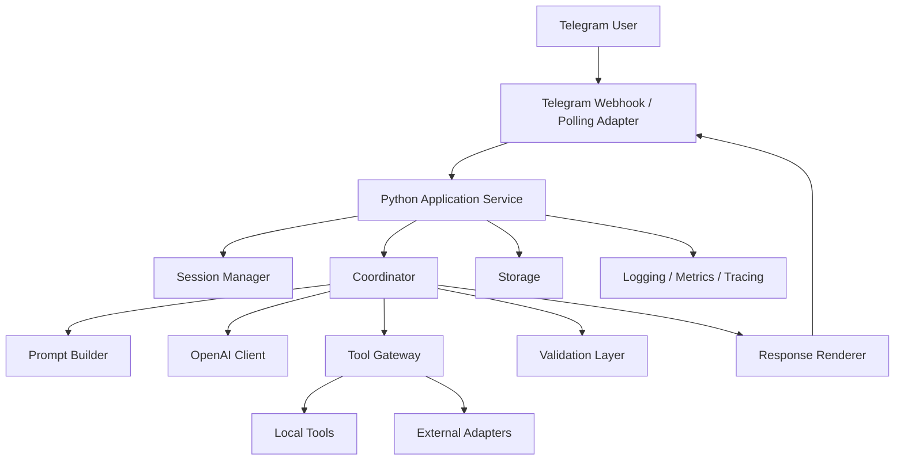

# Implementation Architecture: OpenAI + Python + Telegram

## 1. Purpose

Этот документ описывает конкретную implementation architecture поверх generic baseline из [ARCHITECTURE.md](/Users/kirillostapenko/Documents/New%20project/ARCHITECTURE.md).

Целевой стек:

- LLM provider: OpenAI
- programming language: Python
- delivery channel: Telegram Bot API

Документ уже не vendor-neutral. Он фиксирует конкретные runtime-решения, модули, контракты, operational flow и deployment strategy для первой рабочей версии системы.

## 2. Scope

Система должна:

1. Принимать входящие сообщения из Telegram.
2. Передавать их в coordinator runtime на Python.
3. Использовать OpenAI-модели как основной reasoning engine.
4. Поддерживать tool calling, structured outputs и controlled orchestration.
5. Возвращать ответы обратно в Telegram.
6. Сохранять state, logs и observability отдельно от prompt history.

## 3. Implementation Goals

- минимальный production-ready контур без лишней распределенности
- понятная модульная структура в одном Python-сервисе
- возможность быстро вырасти в multi-worker deployment
- нормальная обработка ошибок Telegram/OpenAI/network
- безопасное обращение с секретами
- подготовленная база для будущего расширения инструментов и subagents

## 4. Recommended System Shape

Для первого этапа рекомендован `modular monolith`.

Причины:

- одна кодовая база
- один deployable service
- простая отладка
- меньше operational overhead
- достаточно гибкости для роста без раннего распила на микросервисы

High-level shape:



## 5. Runtime Decisions

## 5.1 Language and Runtime

- Python `3.11+` or `3.12+`
- async-first runtime
- one main application process with optional worker split later

## 5.2 Interface Mode

For MVP:

- Telegram webhook preferred for production
- long polling acceptable for local development

Recommendation:

- local dev: polling
- staging/production: webhook

## 5.3 Application Style

- async application service
- explicit dependency container or lightweight service registry
- no hidden globals for business logic

## 6. Core Components

## 6.1 Telegram Adapter

Responsibilities:

- receive Telegram updates
- validate update shape
- normalize Telegram payload into internal request
- send response messages back to Telegram
- handle retries and Telegram-specific errors

Input sources:

- message updates
- callback queries if later needed
- command messages like `/start`, `/help`, `/reset`

Normalized output:

- `channel = telegram`
- `user_id`
- `chat_id`
- `message_id`
- `session_key`
- `text`
- `attachments`
- `metadata`

## 6.2 Application Service

This is the top-level Python runtime.

Responsibilities:

- app bootstrap
- config loading
- dependency wiring
- server lifecycle
- graceful shutdown
- scheduler/background jobs if needed

## 6.3 Session Manager

Responsibilities:

- map Telegram user/chat to internal session
- load and persist conversation state
- maintain persistent facts block
- decide when session should reset, resume or compact

Recommended session key:

- `telegram:{chat_id}:{user_id}`

For group chats, optionally include thread/topic identifiers if used.

## 6.4 Coordinator

Coordinator remains the main orchestration unit.

Responsibilities:

- classify request intent
- choose direct answer vs tool-assisted flow
- choose fixed pipeline vs adaptive decomposition
- call OpenAI model
- invoke tools
- decide whether to continue or stop
- synthesize final response

For first version, coordinator can be implemented as a single primary agent loop.

Subagents should be introduced only when:

- task length grows materially
- toolset becomes too wide
- review/verification must be isolated
- context dilution appears in real usage

## 6.5 OpenAI Client Layer

Responsibilities:

- encapsulate all provider interaction
- build requests to OpenAI APIs
- handle retries, timeouts and rate-limit logic
- normalize provider responses to internal model result format

This layer should hide provider specifics from the rest of the app.

Internal contract should expose:

- `create_response(...)`
- `parse_tool_calls(...)`
- `extract_stop_signal(...)`
- `extract_usage(...)`

## 6.6 Tool Gateway

Responsibilities:

- register tools available to the coordinator
- validate tool input
- execute tools
- normalize results
- classify errors
- emit tracing/logging

First version should keep toolset small.

Recommended initial tool groups:

- system/session tools
- retrieval/search tools if needed
- lightweight domain-specific tools

Do not start with a giant tool catalog.

## 6.7 Validation Layer

Responsibilities:

- input validation
- output schema validation
- semantic validation
- conflict detection
- message length checks for Telegram

Telegram-specific concern:

- long model outputs may exceed Telegram message limits
- renderer must chunk output safely when needed

## 6.8 Response Renderer

Responsibilities:

- map internal final response to Telegram-safe message format
- escape Markdown/HTML correctly
- split oversized responses
- attach citations or structured blocks if needed

Rendering rules should be deterministic and separate from reasoning.

## 7. Suggested Python Package Layout

```text
app/
  main.py
  config.py
  bootstrap.py

  api/
    telegram_webhook.py
    telegram_polling.py

  domain/
    coordinator.py
    session_manager.py
    prompt_builder.py
    renderer.py
    policies.py
    models.py

  llm/
    openai_client.py
    response_parser.py
    tool_calling.py

  tools/
    registry.py
    executor.py
    base.py

  adapters/
    telegram_client.py
    storage.py
    cache.py

  persistence/
    repositories.py
    schema.py

  observability/
    logging.py
    metrics.py
    tracing.py

  utils/
    ids.py
    time.py
    retry.py
```

This can later be split, but for now this shape keeps boundaries clear without overengineering.

## 8. Request Flow

## 8.1 Inbound Flow

1. Telegram sends update to webhook or polling loop receives it.
2. Telegram adapter validates and normalizes the update.
3. Session manager resolves current session state.
4. Coordinator builds current working context.
5. OpenAI client sends request.
6. If model requests tools, tool gateway executes them.
7. Coordinator continues loop until final stop condition.
8. Renderer converts result to Telegram-safe output.
9. Telegram adapter sends response to chat.
10. State and logs are persisted.

## 8.2 Error Flow

1. Adapter or runtime catches failure.
2. Error is classified.
3. Retry is applied only if error is retryable.
4. If recovery fails, user receives safe fallback message.
5. Detailed error goes to logs/metrics.

## 9. OpenAI Integration Design

## 9.1 Model Provider Contract

The app should treat OpenAI through an internal provider adapter.

Recommended internal response object:

- `message_text`
- `tool_calls`
- `finish_reason`
- `raw_response_id`
- `usage`
- `latency_ms`

## 9.2 Model Choice

Config should support:

- primary model
- optional fallback model
- optional low-cost utility model for cheap classification or summarization

Even if MVP uses only one model, config should already allow future split.

## 9.3 Tool Calling

OpenAI tool calling should be used for:

- deterministic structured outputs
- safe tool invocation boundaries
- machine-readable loop continuation

Coordinator loop should not inspect prose to decide whether tool execution is needed.

## 9.4 Retry and Backoff

OpenAI client must handle:

- transient network errors
- provider 5xx
- timeouts
- rate limits

Recommended strategy:

- bounded retries
- exponential backoff with jitter
- request correlation id in logs

## 10. Telegram Integration Design

## 10.1 Transport

Recommended production transport:

- HTTPS webhook endpoint

Local development options:

- polling loop
- webhook + tunnel

## 10.2 Message Constraints

Telegram layer must account for:

- message size limits
- parse mode escaping issues
- out-of-order delivery edge cases
- duplicate update handling

## 10.3 User Experience Rules

- acknowledge commands deterministically
- keep error messages short and human-readable
- split long answers into ordered chunks
- keep formatting stable across retries

## 10.4 Idempotency

Incoming Telegram updates should be processed idempotently using:

- update id tracking
- dedupe table or short-lived cache

This avoids duplicate replies when Telegram retries delivery.

## 11. State and Persistence

## 11.1 Persistence Needs

The system should persist:

- sessions
- messages
- persistent facts
- tool execution records
- error events
- model usage metadata

## 11.2 Recommended MVP Storage

Recommended options:

- SQLite for single-instance MVP
- PostgreSQL if multi-instance or higher reliability is needed early

If immediate production reliability matters, choose PostgreSQL from the start.

## 11.3 Suggested Tables

- `sessions`
- `messages`
- `persistent_facts`
- `tool_runs`
- `model_calls`
- `error_events`
- `dedupe_updates`

## 11.4 Persistent Facts Block

Critical data should be stored outside freeform history:

- user preferences
- known constraints
- IDs
- statuses
- important dates
- unresolved tasks

## 12. Prompt Architecture

## 12.1 Layers

Prompt should be built from:

1. system prompt
2. role prompt
3. channel rules
4. session facts
5. recent relevant history
6. tool results
7. output requirements

## 12.2 Telegram-Specific Prompt Rules

Coordinator prompt should include:

- answer in chat-friendly format
- avoid overlong paragraphs
- when uncertain, say so clearly
- do not expose raw tool internals to end user

## 12.3 Structured Output

Whenever response is meant for downstream logic, use structured output contracts rather than plain text.

Examples:

- intent classification
- tool arguments
- routing decisions
- verification findings

## 13. Configuration Design

## 13.1 Required Environment Variables

The implementation should use environment variables, not hardcoded secrets.

Required:

- `OPENAI_API_KEY`
- `OPENAI_MODEL`
- `TELEGRAM_BOT_TOKEN`
- `TELEGRAM_CHAT_ID` if outbound notifications are required globally

Optional:

- `OPENAI_FALLBACK_MODEL`
- `APP_ENV`
- `LOG_LEVEL`
- `DATABASE_URL`
- `WEBHOOK_BASE_URL`
- `PORT`

## 13.2 Typo Tolerance

Because operator config can contain mistakes, config loader may support a compatibility alias:

- if `OPENAI_MODEL` missing and `OAPENAI_MODEL` present, use `OAPENAI_MODEL` with warning log

This should not become the canonical name, but it is a good hardening measure.

## 13.3 Config Loading Rules

- validate required env vars at startup
- fail fast on missing secrets
- redact secrets in logs
- never print raw tokens in exceptions

## 14. Security Design

## 14.1 Secret Handling

- keys and tokens only from environment or secret manager
- never embed secrets in prompts, docs or commits
- redact secrets from logs and traces

## 14.2 Telegram Security

- verify webhook authenticity where applicable
- restrict sensitive bot operations
- avoid leaking internal traces back to chat

## 14.3 OpenAI Security

- isolate provider client in one module
- log request metadata, not sensitive content unless explicitly allowed
- optionally scrub or minimize user data before sending upstream

## 15. Observability

## 15.1 Logging

Structured logs should include:

- request id
- session id
- telegram chat id
- update id
- model name
- tool names
- latency
- error class

## 15.2 Metrics

Track:

- Telegram update throughput
- response latency
- OpenAI latency
- tool error rates
- retry rates
- token usage
- failed deliveries
- duplicate update suppression count

## 15.3 Tracing

Every request should be traceable across:

- Telegram inbound update
- session load
- model call
- tool calls
- renderer
- Telegram outbound send

## 16. Reliability Strategy

## 16.1 Failure Classes

Need explicit handling for:

- Telegram delivery failures
- OpenAI transient failures
- invalid tool responses
- persistence failures
- malformed user input

## 16.2 Recovery Rules

- transient provider/network errors -> retry
- validation errors -> no blind retry
- Telegram send error -> bounded retry then dead-letter/log
- persistence failure -> fail closed, do not pretend session saved

## 16.3 Safe User Fallback

If coordinator cannot complete safely, user should get a short fallback such as:

- temporary processing issue
- please retry shortly

The user should not receive stack traces or raw provider errors.

## 17. Deployment Strategy

## 17.1 MVP Deployment

Recommended:

- single Python service
- reverse proxy or platform ingress
- managed database if using PostgreSQL

## 17.2 Process Model

Options:

- one process for webhook app and orchestration
- later split background jobs into worker process

For MVP, one process is sufficient unless tools become long-running.

## 17.3 Containerization

Recommended:

- Docker image for the Python service
- env-based config injection
- stateless application container

## 18. Testing Strategy

## 18.1 Unit Tests

Test:

- config loading
- session mapping
- prompt building
- tool routing
- renderer chunking
- retry logic

## 18.2 Integration Tests

Test:

- Telegram update normalization
- OpenAI client adapter
- tool loop behavior
- storage persistence

## 18.3 End-to-End Tests

Test full flow:

- inbound Telegram update
- model/tool orchestration
- outbound Telegram reply

Use mocks for provider calls in CI and targeted live smoke tests outside CI.

## 19. Recommended Evolution Path

Phase 1:

- single coordinator
- minimal tools
- one database
- Telegram input/output

Phase 2:

- verification pass
- richer tool layer
- better analytics
- optional fallback model

Phase 3:

- isolated subagents
- queue-backed long tasks
- richer human review and monitoring

## 20. Concrete Build Decision Summary

For this stack, recommended implementation is:

- Python async service
- Telegram webhook adapter
- OpenAI provider adapter
- coordinator-centric orchestration
- small tool gateway
- persistent session/state store
- structured logging and metrics
- environment-based secret management

## 21. Non-Goals for Initial Version

- microservices from day one
- broad multi-agent mesh
- huge tool catalog
- direct embedding of secrets into code or docs
- provider-specific logic leaking across the whole codebase

## 22. Next Step

After this document, the next practical step should be a `SYSTEM_DESIGN.md` or `BUILD_PLAN.md` with:

- exact Python framework choice
- exact OpenAI API usage mode
- exact Telegram library choice
- storage choice
- deployment target
- step-by-step implementation plan
